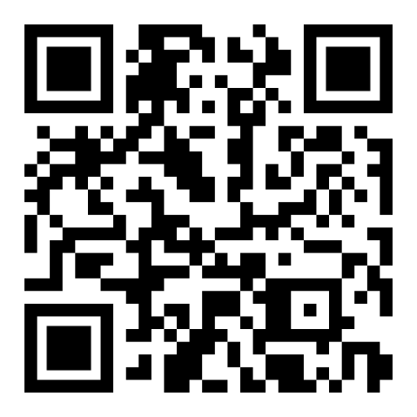
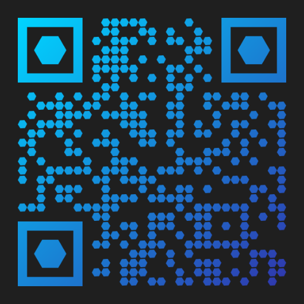

# gqr
`gqr` is a QR code generation library focused on creating customizable QR codes.

This project is a fork of [github.com/yeqown/go-qrcode](http://github.com/yeqown/go-qrcode) with updated API (see Changes)
So big thanks to the initial project! 🙏

# Features
Features marked with `*` are inherited from `go-qrcode`
- [X] Normally generate QR code across version 1 to version 40 `*`
- [X] Automatically analyze QR version by source text `*`
- [X] Applying image size with `WithImageSize`
- [X] Applying padding for QR code with `WithQuietZone`
- [X] Full customization of shapes for modules and finders with `WithModuleShape` and `WithFinderShape`
- [X] Setting colors `*`: `WithBgColor(Hex)`, `WithFgColor(Hex)`
  - [X] Added support for hex colors with alpha channel (8 digits)
  - [X] Gradient with customizable direction via `WithGradient(dir, colors...)`.  
    - Overrides foreground color
    - Colors will be automatically placed evenly on the gradient map
- [X] Advanced logo placing:
  - [X] `WithLogo` places image at center and rescales it to be 1/5 of qr code
  - [X] `WithSpaceAroundLogo` add white space at the center so logo is not placed on top of modules
- [ ] Support Halftones

# Install
```bash
go get -u github.com/quickqr/gqr
```

# Using
[Check other examples](./examples)
```go
package main

import (
  "github.com/quickqr/gqr"
  export "github.com/quickqr/gqr/export/image"
  "github.com/quickqr/gqr/export/image/shapes"
  "image"
  "image/png"
  "log"
  "os"
)

func main() {
  qr, e := gqr.NewWith(
    "https://github.com/quickqr/gqr",
  )

  if e != nil {
    log.Fatal(e)
  }

  logoFile, _ := os.Open("./gopher.png")
  logo, _, _ := image.Decode(logoFile)

  // Export QR code to image
  img := export.
          NewExporter(
            export.WithBgColorHex("#1f1f1f"),

            export.WithLogo(logo),
            export.WithSpaceAroundLogo(),

            export.WithFinderShape(shapes.RoundedFinderShape(0.5)),
            export.WithModuleShape(shapes.RoundedModuleShape(0.5)),

            // Apply gap between modules
            export.WithModuleGap(0.1),
            // Size of the outputted image in pixels
            export.WithImageSize(512),
            // Padding around QR code
            // Note: actual QR code size will be (image size - quiet zone * 2)
            export.WithQuietZone(30),

            // Gradient for foreground with direction from Top Right to Bottom Left
            export.WithGradient(export.GradientDirectionTRBL,
              export.ParseFromHex("#cc33ff"),
              export.ParseFromHex("#ff9900"),
              // You also can use any color.Color instance
            ),
          ).
    Export(*qr)

  // Save the image
  f, _ := os.OpenFile("../assets/main.png", os.O_CREATE|os.O_WRONLY, 0644)
  if err := png.Encode(f, img); err != nil {
    log.Fatal(err)
  }
}
```

# Showcase
All of these pictures are generated by programs in [examples](./examples):
<div float="left">




</div>